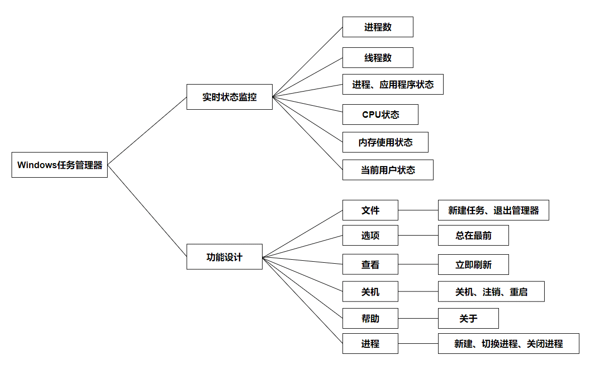

# 操作系统课程设计

高仿版win10任务管理器？

---

* 使用c++基于Qt框架开发

	仿照Windows10系统中新版的任务管理器进行了功能和页面设计
	使用了树状列表展示进程，可查看每个进程的子进程，同时可分别依据单个属性进行正序和倒序排序展示
	应用列表、用户列表同样可进行排序展示，同时可查看当前用户所开启的进程
程序逻辑流程图：

设计思路：
为了保证软件运行速度，我们采用了多线程来实现软件的功能。
主线程只负责数据与界面的绑定以及界面信息更新等工作，计算量较大的信息获取等工作，交由子线程进行。
通过在子线程中调用WinAPI的相关函数，获得进程、应用以及系统的相关信息。

